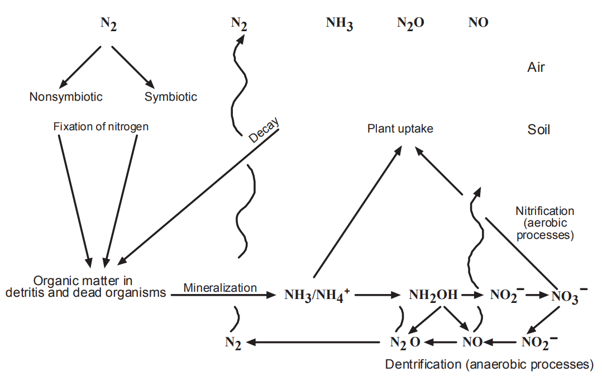
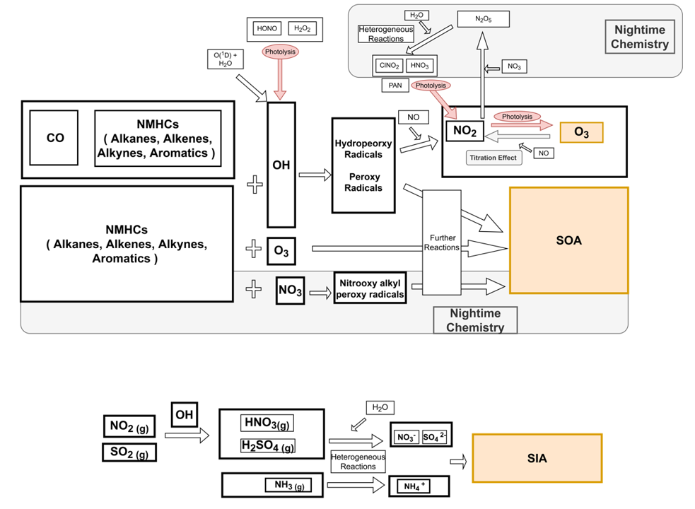

# W12_0510（丁）

The Nitrogen and Sulfur Cycles– 
The nitrogen cycle 

- Nitrogen is part of the abiotic (non-living) and biotic (living) parts of earth.
- The element exists in myriad chemical forms that move at varying rates in the nitrogen cycle.
- Like carbon discussed in the previous chapter, N is stored in reservoirs such as the atmosphere, living organisms, soils, and oceans.
- From these sinks, N cycles between the biosphere and the atmosphere. The N cycles among ecosystems and the organisms, including humans, within these ecosystems.

---

- Most of the earth’s mass of N resides in the atmosphere. Approximately 79% of the molecules in Earth’s atmosphere are molecular nitrogen (N2).
- All organisms must metabolize N into larger molecules; notably amino acids, proteins, and deoxyribonucleic acid (DNA).
- Amino acids contain the functional group amine (NH2) and are the building blocks of proteins.
- DNA consists of adenine, cytosine, guanine, and thymine, which consist of rings of carbon and nitrogen atoms, with various side chains.
- The N2 is not directly available to most organisms (a major exception being the N-fixing bacteria found in legume roots).
- The atmospheric N2 is converted to bioavailable N species (e.g. nitrates; NO3 ) abiotically (e.g. lightning strikes or fires) and biotically (e.g. by the N-fixing bacteria known as diazotrophs).

---

- Decomposers convert N in the opposite direction, i.e. mineralization, converting the N-containing organic molecules of dead organisms to inorganic compounds, e.g. ammonium (NH4+) salts. The (NH4+) salts have high aqueous solubility and readily absorbed to soil particles.
- At these sites, bacteria and other microbes can oxidize the NH4+ into nitrite (NO2- ) compounds and in turn to nitrate (NO3- ) compounds. This oxidation process is known as nitrification.
- These dissolved oxidized forms of N are reduced (i.e. denitrified) by bacteria known as denitrifiers. This is a major process by which N is returned to the atmosphere.
- Ionization is an important part of N and S cycling, as it is for all nutrient cycling.
- This is due to the configuration of electrons in an atom. The arrangement of the electrons in the atom’s outermost shell, i.e. valence, determines the ultimate chemical behavior of the atom.

---

- The outer electrons become involved in the transfer and the sharing the shells with other atoms, i.e. forming new compounds and ions.
- An atom will gain or lose valence electrons to form a stable ion that has the same number of electrons as the noble gas nearest the atom’s atomic number. 
- As mentioned, the N cycle includes three principal forms that are soluble in water under environmental conditions: the cation (positively charged ion) ammonium (NH4+) and the anions (negatively charged ions) nitrate (NO3-) and nitrite (NO2-).
- Nitrates and nitrites combine with various organic and inorganic compounds.
- Following entry into the body, NO3- is converted to NO2- . Since NO3- is soluble and readily available as a nitrogen source for plants (e.g. to form plant tissue such as amino acids and proteins), farmers are the biggest users of NO3-  compounds in commercial fertilizers (although even manure can contain high levels of NO3 ).

---

- Nitrogen in several forms finds its way from the atmosphere to the soil through abiotic and biotic processes.
- NO3-  compounds are formed from lightning and by nitrogen-fixing bacteria in legumes’ root nodules.
- The Rhizobia (genera Rhizobium, Sinorhizobium, and Bradyrhizobium) are Gram-negative motile, rod-shaped, aerobic soil bacteria that infect legume roots in a symbiotic relationship with legumes, e.g. Medicago, Melilotus, and Trigonella.
- The symbiotic relationship results from the bacteria fixing atmospheric nitrogen, providing ammonium for protein production in the plant. In exchange, the bacteria obtain energy from the plant.
- Nitrate compounds are also formed by microbial (fungal and bacterial) degradation of detritus by aerobes and anaerobes on the forest floor.
With moisture, numerous simultaneous chemical reactions occur, making for a balance among various chemical forms of N (as well as those of S, P, K, C, and other nutrients).

---

- The chemical reactions in the N cycle, as in any nutrient cycle, require various energy sources, especially light, heat, and metabolic energy. 
- Some biochemical processes within an organism fix molecular nitrogen (N2) from the atmosphere to form simple N-compounds (e.g. diazotrophs in root nodules), which in turn form amino acids in the tissues of plants and animals.
- The mineralization and denitrification occurs by numerous processes, in addition to microbial degradation, including photolysis, hydrolysis, and reduction or oxidation. 
- The result is a wide array of conversions of nitrogen-containing organic compounds (e.g. proteins and amino acids) to inorganic (mineral) forms, such as ammonia, ammonium hydroxide, nitrite, and nitrate.
- Note that the gases at the top of Figure in next slide include those that are important in air pollution.

---

---

- For example, NO is one of the compounds involved in the photochemistry that leads to the formation of the pollutant ozone (O3) in the troposphere.
- Note also that the relationship between microbes and macrophytes is central in the figure.
- Much of the chemistry occurs on the floor in the detritus where microbes degrade complex molecules. 
- Nutrients in the soil are transported by the roots capillary action to plant cells. Gases are transpired through leaves back to the atmosphere.
- The atmospheric speciation at the top of the Figure is an oversimplification, with many competing processes.
- For example, NO2  compounds in the soil can release nitrous acid (HONO) directly to the atmosphere. When soil contains elevated amounts of nitrates due to fertilization, HONO is released to the atmosphere.
- The more acidic the soil, the greater will be the release of HONO.

---

- In the troposphere, HONO leads to the formation of hydroxyl radicals, which both degrade and increase the deposition of air pollutants.
- Large volumes of acids are released from soil continuously to the atmosphere. Soils with high N concentrations form the acids from NO2  ions.
- These anions are first released into the soil by microbes that have transformed ammonium and nitrate ions into nitrite ions. 
- Increasing soil acidity produces high nitrite concentrations, leading to greater concentrations of HONO emitted to the troposphere.
- About 30% of the primary OH radical production is attributed to the photolysis of HONO.
- The Figure also shows that when organic compounds are degraded by microbes, especially nitrifying bacteria, oxides of nitrogen (NOx) are released to the atmosphere.
- The flux of nitric oxide (NO) and nitrogen dioxide (NO2) from the soil to the lower troposphere is inversely related to the rate of degradation of organic compounds in the soil.

---

- Ion exchange is actually an example of sorption; i.e., movement of a chemical species from the liquid or gas phase to the solid phase.
- Plants grow as a function of available nutrients that they are able to sorb, which is affected by available N and other cycles within the forest ecosystem.
- With this growth, compounds of N and other nutrients find their way to the atmosphere.
- Nitrogen has three common oxidation states, +3, +4, and +5. Thus, like carbon, the multiple oxidation states mean that N can form many compounds, even with a single, other element.
- For example, it can combine with oxygen to form N2O, NO, NO2, or N2O5, all important air pollutants or precursors to air pollutants.

---

- Nitrite is an intermediate compound in both nitrification and denitrification.
- The N in the nitrate anion (NO3- ) has an oxidation state of +5 (i.e. three O atoms each with 2 charge plus 5 yields the nitrate charge of 1).
- The nitrite anion has a trivalent N, i.e. N3+ (i.e. two O atoms each with 2 charge plus 3 yields the nitrite charge of 1).
- The major mechanism for producing N3+ in soil is by biological nitrification and denitrification processes.
- Nitrifying microbes produce nitrite ions from ammonium. Denitrifying microbes produce nitrite from nitrate.
- In addition to the ordinary concentrations of molecular N, various nitrogen compounds are formed from reactions ranging from very fast (especially combustion) to quite slow, multistage (microbial) reaction rates.
- The two principal air pollutants regulated throughout the world are nitric oxide and nitrogen dioxide.

---

$\require{mhchem}$

- Nitric oxide (NO) is a colorless, odorless gas and is essentially insoluble in water. Nitrogen dioxide (NO2) has a pungent acid odor and is somewhat soluble in water.
- Air pollution experts now refer to NO and NO2 collectively as NOx. This is in part because the NO lifetime after emission is quite short (>minute <hour).
- The simple oxidation of molecular N at high temperature is
$\ce{N2 + O2 ->[\Delta] 2NO}$
(22.1)
- The emitted NO rapidly undergoes photochemical transformation to NO2:
    $\ce{2NO + O2 -> 2NO2}$
(22.2)
- Indeed, NO and NO2 can interconvert, depending on redox and photochemical conditions in the troposphere and stratosphere.
- For example, in sunlight, ultraviolet radiation splits NO2 into NO and O. So, it is often preferred to consider the dynamic relationship of the two molecules rather than to ascribe a single speciation, especially for characterizing the atmosphere.

---

- However, the two compounds must be distinguished in risk assessments given their very different health effects.
- Mobile sources (i.e. cars, trucks, trains, boats, and aircraft) comprise the largest contributor to NOx emissions in the Untied States (59%; 12.7 Mt in 2002).
- The US’s largest contributing stationary source category is electric generation (22%; 4.6 Mt in 2002), followed by industrial factories (11%; 2.4 Mt in 2002).
- Europe has similar emission profiles for NOx, with the largest percentage coming from mobile sources (road and nonroad transport), and the largest stationary source being energy production and distribution.
- Although both NO and NO2 can be harmful to humans and ecosystems, NO is also actually essential to metabolism, so is harmful at much higher concentrations than that of NO2.
- On the other hand, NO2 is inherently toxic, causing respiratory problems.

---

- Both compounds are precursors to tropospheric ozone formation, so present indirect health problems when the smog and O3 are inhaled.
- Nitrogen species important to air quality include many compounds in addition to NOx.
- Atmospheric N reactions can be more complicated than may be inferred from Reactions (22.1) and (22.2).
- For example, the NOx reaction from NO to NO2 likely involves water and an intermediate, i.e. nitrous acid (HONO):

$\ce{4NO +O2 +2H2O -> 4HONO}$

- The larger suite of N air pollution compounds is known as total reactive nitrogen, which is denoted as NOy. This suite includes NO and NO2, plus their oxidation products.

---

- The major vapor phase and particulate constituents of NOy include NO, NO2, nitric acid (HNO3), peroxyacetyl nitrate (PAN), HONO, organic nitrates, and particulate nitrates:

$\ce{NO_{y}= NO2 + NO +HNO_3 +PAN}
\\\ce{ + 2NO2O5 + HONO + NO3}
\\\ce{+ NO3- compounds + NO3-  aerosols}$

- Every NOy compound is derived directly from NOx emissions or through transformations in the troposphere
- Most of the compounds originate from combustion processes.
- The atmosphere itself is the source of much of the nitrogen leading to the formation of nitrogen compounds.
- Molecular nitrogen (N2) makes up the largest share of gaseous content of the earth’s atmosphere (79% by volume). Because N2 is relatively nonreactive under most atmospheric conditions, it seldom enters into chemical reactions, but under pressure and at very high temperatures, such as in an internal combustion engine or industrial boiler, the molecular N will react with O2, i.e. Reaction (22.1).

---

- Approximately 90 - 95% of the nitrogen oxides generated in combustion processes are in the form of NO.
- Other nitrogen oxides can also form at high heat and pressure, especially NO2.
- Most motor vehicles around the world still employ temperature/high-pressure internal combustion engines.
- Such mobile sources contribute largely to the tropospheric concentrations of NOx, making it a major mobile source of air pollutant in terms of human health directly (e.g. respiratory toxicity of NO2) and indirectly (i.e. NOx as the key components in tropospheric ozone production).
- These conditions of high temperature and pressure can also exist in boilers such as those in power plants, so NOx is also commonly found in high concentrations leaving fossil fuel power generating stations.
  
---

- In addition to the atmospheric molecular nitrogen as a precursor of nitrogen air pollutants of combustion, fossil fuels themselves contain varying concentrations of N.
- Unlike the sulfur compounds, which mainly exit stationary source stacks as vapor phase compounds (e.g. SO2 and other oxides of sulfur), a significant fraction of the fuel nitrogen burned in power plants and other stationary sources remains in the bottom ash or in unburned aerosols in the gases leaving the combustion chamber, i.e. the fly ash. 
- Nitrogen oxides can also be released from nitric acid plants and other types of industrial processes involving the generation and/or use of nitric acid (HNO3).
- At temperatures far below combustion, such as those often present in the ambient atmosphere, NO2 can form the molecule NO2-O2N or simply N2O4 that consists of two identical simpler NO2 molecules. This molecular configuration is known as a dimer.
- The dimer N2O4 is distinctly reddish brown and contributes to the brown haze that is often associated with photochemical smog incidents.

---

- In addition to the health effects associated with NO2 exposure, much of the concern for regulating emissions of nitrogen compounds is to suppress the reactions in the atmosphere that generate the highly reactive molecule ozone (O3).
- Nitrogen oxides play key roles in O3 formation. Ozone forms photochemically (i.e. the reaction is caused or accelerated by light energy) in the lowest level of the atmosphere, known as the troposphere, where people and other biota live.
- Nitrogen dioxide is the principal gas responsible for absorbing sunlight needed for these photochemical reactions.
- In the presence of sunlight, the NO2 that forms from the NO incrementally stimulates the photochemical smog-forming reactions because nitrogen dioxide is very efficient at absorbing sunlight in the ultraviolet portion of its spectrum.
This is why ozone episodes are more common in the summer and in areas with ample sunlight.

---

- Other chemical ingredients, i.e. ozone precursors, in O3 formation include volatile organic compounds, and carbon monoxide (CO). Governments regulate the emissions of precursor compounds to diminish the rate at which O3 forms.
- Cyanide (CN) is another N anion that is important to air pollution.
- Cyanide in the bloodstream impairs oxidative phosphorylation, a process by which oxygen is taken up for the production of essential cellular energy in the form of adenosine triphosphate (ATP).
- This process transfers electrons from nicotinamide adenine dinucleotide to form water from H+ and O2, through a series of reactions catalyzed by enzymes.
- With less O2 available to react with the cytochrome C and hence complete the electron transport process, ATP production is diminished.
- The high binding affinity of CN to the ferric ion in hemoglobin is responsible for the decrease in O2 carried in the blood. Thus, CN binds preferentially to hemoglobin and prohibits oxygen binding

---

---

- Methemoglobinemia is a particularly troublesome outcome resulting from endogenous production of the CN anion, such as from the exposure of infants to nitrates in drinking water. 
- Ingesting high concentrations of nitrates can cause serious short-term illness and even death in infants of 6 months or younger.
- The serious illness in infants is due to the conversion of microbial NO3-  to NO2-  in the gastrointestinal tract.
- NO3- is more easily converted to NO2- than in adult hemoglobin and circulatory system, which are too immature in small children to return to normal hemoglobin.
- As a result, the increased NO2- concentrations interfere with the oxygen-carrying capacity of the blood.

---

## The Nitrogen and Sulfur Cycles– 

Interactions between Sulfur and Nitrogen 

- From the standpoint of air pollution, the biogeochemical cycles must not be limited to single elements.
- As shown in Figure 22.6, after a compound is emitted, it reacts with numerous other compounds and changes physically and chemically. 
- It is transported advectively, is dispersed, and finally deposited to the earth’s surface, where it continues to undergo physical, chemical, and biological changes.
- This is demonstrated by the interactions of N and S in acid deposition, as well as by the integration of myriad atmospheric chemical species that influence and are influenced by N and S.
- This includes both the formation of conventional NAAQS pollutants, like ozone and particulate matter (PM), as well as the transformation and changes in bioavailability of toxic air pollutants, e.g. mercury (Hg) and semivolatile organic compounds like dioxins and organochlorine pesticides.

